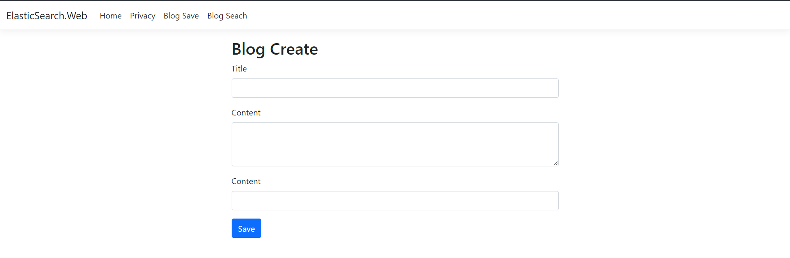
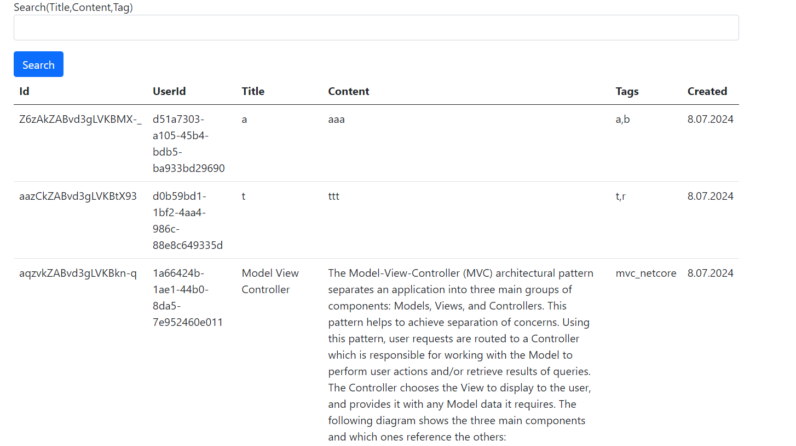
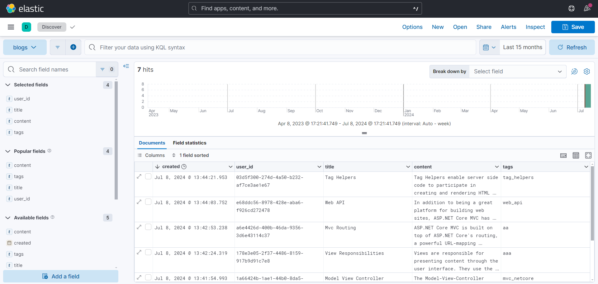
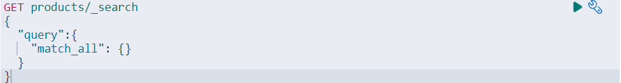
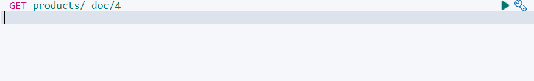
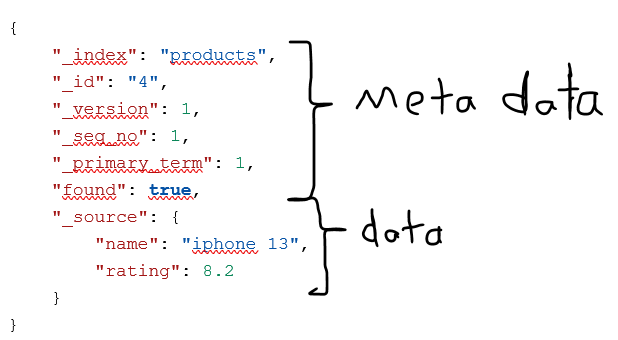
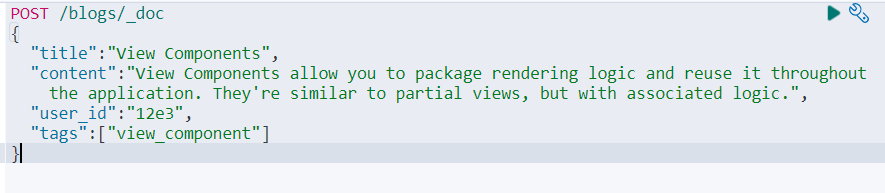
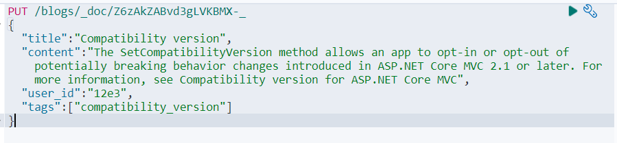
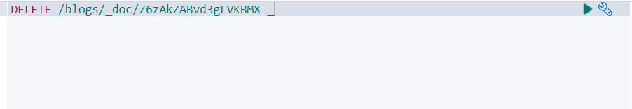

<h1>ElasticSearch ile Blog Projesi</h1>
<h3>1. Giriş</h3>

Gerçekleştirilen bu proje, ElasticSearch NoSQL veritabanının kullanıldığı basit bir blog projesidir. Projede amaç, elasticsearch veritabanını öğrenmek ve özellikle büyük boyutlu yapısal olmayan veriler üzerinde arama gücünü görmektir.

ElasticSarch, açık kaynaklı NoSQL bir veritabanıdır. Verileri json formatında kaydeder. En önemli özelliği, büyük boyutlu text dosyalarında çok hızlı ve performanslı bir şekilde arama yapabilmesidir. Arka planda Apache lucene kütüphanesini kullanır. Genelde hacimli datalar üzerinde arama yapmada kullanılır. Performanslı olmasının sebebi, text datası üzerindeki her bir kelimeyi indekslemesidir. Bu sayede oldukça performanslı bir arama sağlar.Elasticsearch’de tablolar indeks, satırlar doküman olarak adlandırılır.

ElasticSearch üzerindeki veriler, Kibana adı verilen bir uygulama ile görselleştirilebilir, bu veriler üzerinde KQL dili ile çeşitli sorgulamalar yapılabilir. MSSQL'deki SQL Server Management Studio aracı gibi düşünülebilir.

<h3>2. Kullanılan Dil ve Teknolojiler</h3>
C# - Asp.Net Core Mvc, ElasticSearch, DockerCompose - .Net 8

<h3>3. Ekran Görüntüleri</h3>

Kibana:

<h3>4. KQL Dili ile Örnek Sorgular</h3>
<ul>
<b>Örnek bir get isteği</b>
<li>

</li>
<b>Id'ye göre veri getirme</b>
<li>

</li>
<b>Dönen sonuç</b>
<li>
 
<b>_version:</b> ilgili data’nın kaçıncı versiyonda olduğunu belirtir. Data, her güncellendiğinde bu sayı birer artar. 
<b>_seq_no:</b> ilgili data üzerinde gerçekleşen tüm crud işlemlerini belirtir. 
<b>_source:</b> data’nın asıl gövdesinin olduğu kısım. Ancak burada id olmadığına dikkat et. id, _doc ile beraber gelir.
</li>
 
<b>Post ile veri ekleme</b>
<li>

</li>
 
<b>Put ile veri güncelleme</b>
<li>

</li>
 
<b>Delete ile veri silme</b>
<li>

</li>
</ul>
